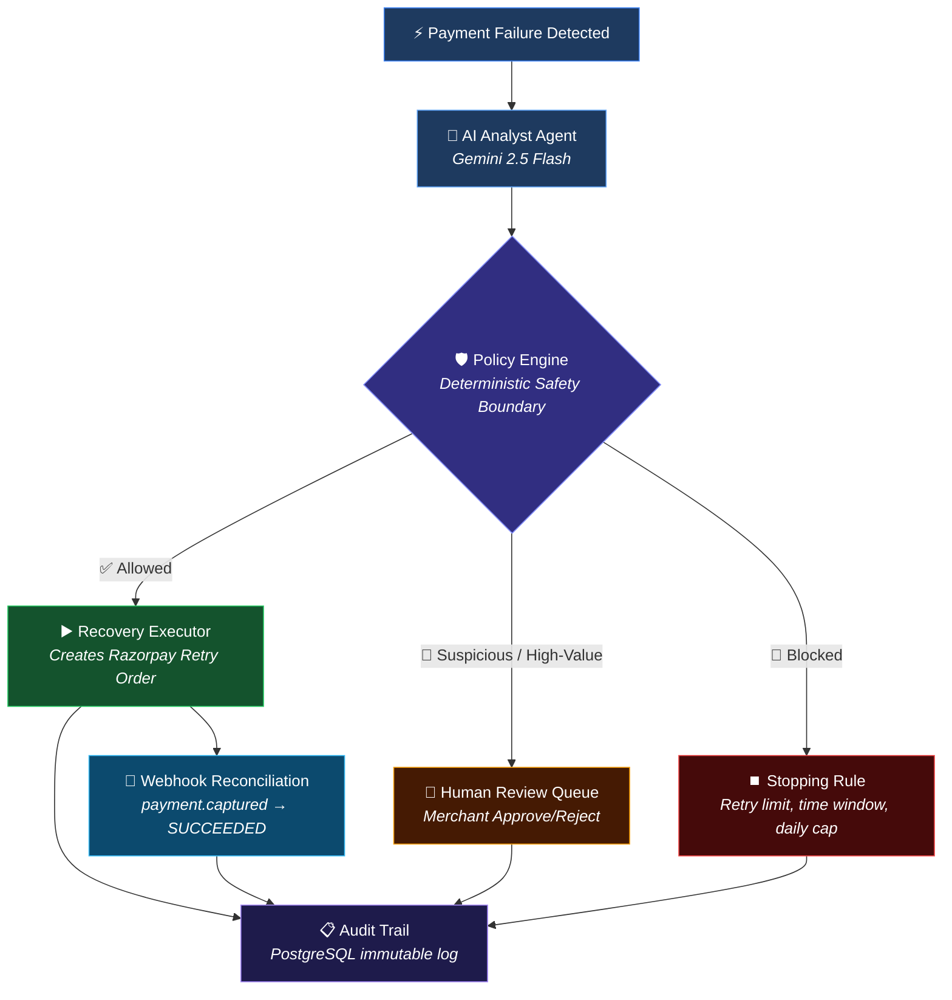

# RecoveryOS ⚡

**Autonomous AI Revenue Recovery Agent** — Razorpay AI Buildathon · Track 03

RecoveryOS detects revenue at risk, uses an AI analyst (Gemini 2.5 Flash + Structured Outputs) to diagnose root causes, enforces deterministic safety guardrails, and executes bounded recovery actions via Razorpay's real API. Every step is audited. Every unsafe action is blocked.

---

## How It Works



## 50,000-Event Evaluation

Evaluated against a synthetic batch of 50k payment failures:

| Metric | Value |
|--------|-------|
| Baseline Recovery (Static Rules) | ₹5.98 Cr |
| **RecoveryOS Recovery (AI Agent)** | **₹14.25 Cr** |
| **Incremental Uplift** | **+138.2%** |
| Unsafe Action Rate | **0.0%** |
| Policy Blocks (Fraud + High-Value) | 6,250+ |

The AI identifies high-probability recovery opportunities that static retry-once rules miss, while the Policy Engine guarantees zero unauthorized API execution.

---

## Key Engineering Decisions

### 1. The AI Proposes, the Policy Engine Disposes
The LLM generates a `RecoveryDecision` with a probability estimate. The deterministic `RecoveryPolicyEngine` then independently evaluates 7 safety rules (retry limit, fraud, high-value threshold, time window, daily cap). The AI **cannot** bypass the policy engine. This is the architectural guarantee that makes autonomous execution safe.

### 2. Real Stopping Rules, Not Hardcoded Limits
- **72-hour recovery window**: No retries after 3 days from first failure
- **5 attempts/day per customer**: Prevents harassment
- **Max 2 retry attempts per payment**: Hard cap
- All thresholds are configurable constants, not magic numbers buried in code.

### 3. Immutable Audit Trail
Every discrete step writes to `audit_log` in PostgreSQL: detection → AI diagnosis → policy decision → execution outcome → webhook reconciliation. The trail is queryable by `payment_id`, giving complete provenance for any recovery action.

### 4. Idempotent Execution
`WebhookRecord` uses a composite primary key (`event_id` + `provider`) to prevent duplicate processing. The execution layer generates unique `execution_id` values. A crashed worker cannot accidentally execute the same recovery twice.

### 5. Webhook Reconciliation Closes the Loop
When Razorpay sends `payment.captured`, our webhook handler verifies the signature, idempotently stores the event, and transitions the execution from `STARTED → SUCCEEDED`. This is how we measure actual recovery — not just intent.

### 6. Strict Environment Boundaries & Security
We use strict Pydantic `Field` declarations for all configurations. API keys and secrets (like `api_key`, `razorpay_key_secret`) are rigorously decoupled from code and must be injected via `.env`. A dedicated `/safety/adversarial` route actively tests the AI boundary against prompt injections and negative amount manipulation, proving the Policy Engine holds the line against attacks.

### 7. Graceful Degradation (Taxonomy Fallback)
If the Gemini API hits a rate limit (429) or goes offline, the system doesn't crash. It falls back to a deterministic YAML taxonomy (`_taxonomy_fallback`), meaning payments continue to process offline. AI is treated as an enhancement, not a single point of failure.

---

## Documentation Suite

We have documented the entire architecture, evaluation methodology, and compliance guardrails of the system:
- [Architecture & Truth Model](docs/ARCHITECTURE.md)
- [Methodology & 50k Benchmark](docs/METHODOLOGY.md)
- [Compliance, Gates & Stops](docs/COMPLIANCE.md)
- [Failure Taxonomy & Action Verbs](domain/policy/taxonomy.yaml)
- [Demo Pitch Script](docs/DEMO.md)

---

## What Broke, and How I Fixed It

1. **Circular import death spiral**: `RecoveryAuthorization` was defined in two modules. The orchestrator imported from `authorization.py` which imported from `service.py` which imported from `execution/` which imported `authorization.py`. Fixed by making `service.py` the canonical source and turning `authorization.py` into a re-export shim.

2. **Database schema drift**: Added `customer_id` to the SQLAlchemy model but `Base.metadata.create_all` doesn't ALTER existing tables. Production consequence: every query crashed with `UndefinedColumn`. Created `scripts/reset_db.py` to handle destructive migrations during development.

3. **Fraud never reached the escalation queue**: The `suspicious` flag was hardcoded to `False` in the recovery endpoint. Payments flagged as `suspected_fraud` by the AI were still being auto-executed. Fixed by deriving the flag from the failure reason.

4. **Empty scaffolding directories**: ~20 empty `__init__.py`-only directories (`infrastructure/`, `domain/customer/`, `docs/`) made the repo look like boilerplate. Removed everything that had no real code.

5. **Hardcoded Secrets**: The API test key (`ros_demo_key_2026`) was hardcoded in `config.py`. Refactored `Settings` to strictly enforce environment variable loading using Pydantic `Field(...)`, ensuring the app fails to start securely if misconfigured.

---

## 76 Passing Tests

```
tests/unit/test_audit_service.py       — 9 tests (every audit event type)
tests/unit/test_stopping_rules.py      — 10 tests (time window, daily cap, priorities)
tests/unit/test_review_models.py       — 3 tests (review lifecycle)
tests/unit/test_policy_engine.py       — 7 tests (all safety rules)
tests/unit/test_recovery_actions.py    — 5 tests (domain model invariants)
tests/unit/test_recovery_decision.py   — 5 tests (probability bounds)
tests/unit/test_execution_*            — 10 tests (orchestrator, repository, executor)
tests/unit/test_recovery_application_* — 5 tests (authorization boundary)
tests/integration/test_razorpay_*      — 8 tests (gateway + executor)
tests/unit/test_webhook_processor.py   — 2 tests (idempotent reconciliation)
```

Run: `make test`

---

## Getting Started

```bash
# 1. Start PostgreSQL + Redis
docker-compose up -d

# 2. Configure environment
cp .env.example .env
# Fill in: RAZORPAY_KEY_ID, RAZORPAY_KEY_SECRET, GEMINI_API_KEY

# 3. Initialize database
PYTHONPATH=. python scripts/init_db.py

# 4. Start backend (FastAPI)
make dev

# 5. Start frontend (Next.js)
make web
```

---

## Production TODOs

These are intentionally deferred for a hackathon scope, but documented for completeness:

- [ ] Rate limiting on `/recoveries/execute` (prevent AI agent spam)
- [ ] Alembic migrations (currently using `create_all` — fine for dev, not for prod)
- [ ] Background job queue (Celery/ARQ) for batch recovery processing
- [ ] Prometheus metrics export
- [ ] Multi-tenant isolation (currently single-merchant)
- [ ] Webhook retry with exponential backoff

---

## Tech Stack

| Layer | Technology |
|-------|-----------|
| AI Agent | Gemini 2.5 Flash (Structured Outputs) |
| Backend | FastAPI + SQLAlchemy (async) |
| Database | PostgreSQL 16 |
| Frontend | Next.js 15 + Framer Motion |
| Payments | Razorpay Test Mode API |
| Testing | Pytest (76 tests, 0.6s) |

---

Built for the Razorpay AI Buildathon 2026. ✨
