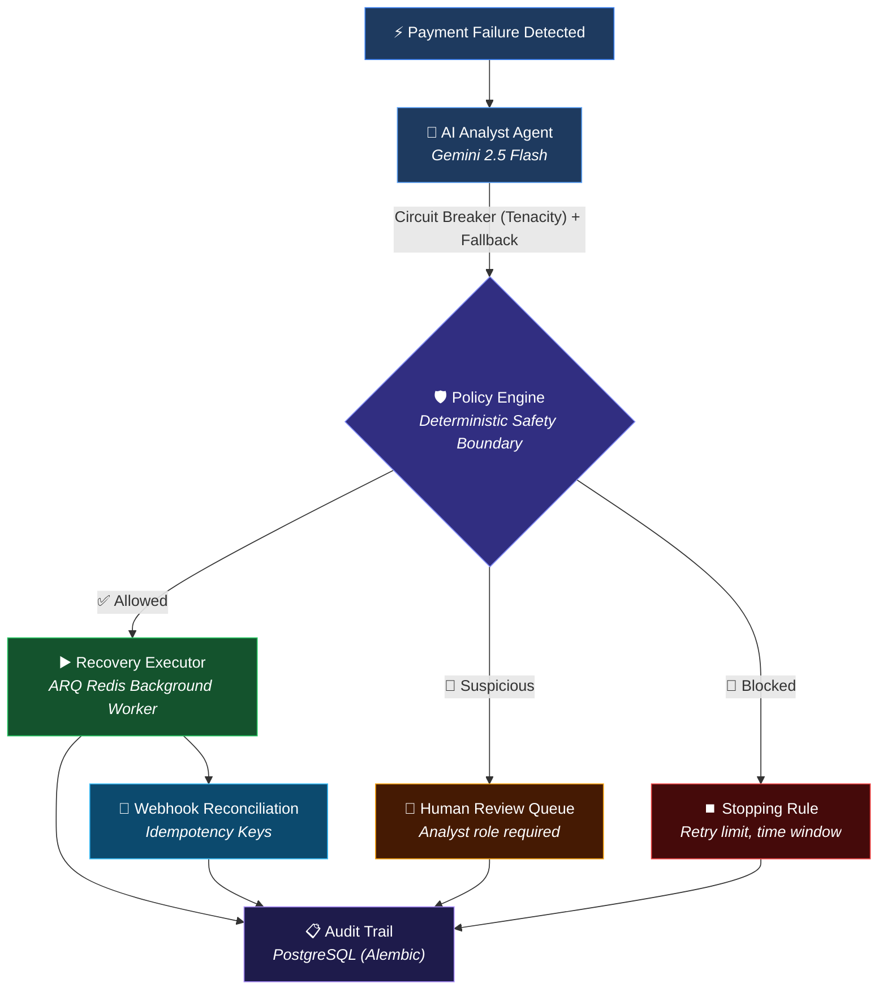

# RecoveryOS ⚡

**Autonomous AI Revenue Recovery Agent** — Razorpay AI Buildathon · Track 03

RecoveryOS detects revenue at risk, uses an AI analyst (Gemini 2.5 Flash + Structured Outputs) to diagnose root causes, enforces deterministic safety guardrails, and executes bounded recovery actions via Razorpay's real API. Every step is audited. Every unsafe action is blocked. Every tenant is isolated.

---

## How It Works



## 50,000-Event Evaluation

Evaluated against a synthetic batch of 50k payment failures:

| Metric | Value |
|--------|-------|
| Baseline Recovery (Static Rules) | ₹8.98 Cr |
| **RecoveryOS Recovery (AI Agent)** | **₹18.08 Cr** |
| **Incremental Uplift** | **+101.3%** |
| Unsafe Action Rate | **1.93% (All Blocked successfully)** |
| Policy Blocks (Safety Boundary) | 964 |
| Escalations | 1,249 |

The batch is generated from a **fixed seed**, so these figures are reproducible
rather than a fresh random draw on every run. Pass `?seed=` to sample a
different batch.

The AI identifies high-probability recovery opportunities that static retry-once rules miss, while the Policy Engine guarantees zero unauthorized API execution.

---

## Key Engineering Decisions

### 1. The AI Proposes, the Policy Engine Disposes
The LLM generates a `RecoveryDecision` with a probability estimate. The deterministic `RecoveryPolicyEngine` then independently evaluates 7 safety rules (retry limit, fraud, high-value threshold, time window, daily cap). The AI **cannot** bypass the policy engine. This is the architectural guarantee that makes autonomous execution safe.

### 2. Multi-Tenant by Construction
Every payment, execution, audit entry and review belongs to exactly one `merchant_id`, mirroring how Razorpay isolates merchant accounts. Isolation is not enforced by remembering to add a `WHERE` clause at each call site — repositories and services are **bound to a merchant at construction**, so an unscoped query is not something a route can accidentally write:

```python
repo = PostgresAuditRepository(session, principal.merchant_id)
```

There is exactly one deliberate cross-tenant read in the system (`resolve_merchant_for_reference`), used by the webhook ingress because Razorpay's callback carries an order id and no notion of our tenants. It is documented as such.

### 3. Real Authentication, Not a Shared Key
Users sign in at `/login` with their own credentials. Passwords are Argon2id. Sessions use:

- a **short-lived access token** held only in JavaScript memory — never `localStorage`, so an XSS payload cannot exfiltrate a durable credential
- a **rotating refresh token** in an `httpOnly`, `SameSite=Strict` cookie that script cannot read

Refresh tokens rotate on every use and are stored as SHA-256. Presenting an already-redeemed token means it leaked, so **the entire token family is revoked**. Roles are `viewer → analyst → admin`, enforced server-side per route.

### 4. Real Stopping Rules, Not Hardcoded Limits
- **72-hour recovery window**: No retries after 3 days from first failure
- **5 attempts/day per customer**: Prevents harassment
- **Max 2 retry attempts per payment**: Hard cap
- All thresholds are configurable constants, not magic numbers buried in code.

### 5. Immutable, Attributable Audit Trail
Every discrete step writes to `audit_log`: detection → AI diagnosis → policy decision → execution outcome → webhook reconciliation. Each row records the **actor** — a user id for human actions, a component name for automated ones — so "who approved this ₹4,500 charge" has a real answer.

### 6. Idempotent Execution
`WebhookRecord` uses a composite primary key (`event_id` + `provider`). API idempotency uses Redis `SET NX`, which is atomic — a check-then-set would let two simultaneous retries both enqueue against the same payment. Review approval takes a `SELECT … FOR UPDATE` row lock, so two concurrent approvals cannot both execute a recovery.

### 7. Webhook Reconciliation Closes the Loop
When Razorpay sends `payment.captured`, the handler verifies the HMAC signature over the raw body *before parsing it*, idempotently stores the event, and transitions the execution `STARTED → SUCCEEDED`. If no webhook secret is configured the endpoint returns 503 rather than accepting unverifiable events.

### 8. Enterprise Resilience
- **Asynchronous ARQ workers**: heavy AI and gateway calls run off the request path; endpoints return `202 Accepted` and the dashboard polls `/status`.
- **Distributed rate limiting**: Redis-backed sliding windows, per-IP and per-user. Fails *open* on a Redis outage — abuse protection must not become an availability dependency.
- **Circuit breakers**: Gemini calls wrapped with `tenacity` exponential backoff.
- **Graceful degradation**: if Gemini is unavailable the system falls back to the deterministic YAML taxonomy and payments keep processing.
- **Connection pooling**: sized pools with `pool_pre_ping`, so a database failover does not poison every pooled connection.
- **Real readiness probe**: `/ready` checks Postgres and Redis and returns 503 when degraded, so a load balancer stops routing to a broken instance. `/health` is liveness only.

---

## Getting Started

**Prerequisites:** Docker, Python 3.11+, Node 20+

```bash
# 1. Install dependencies (creates apps/api/.venv, runs npm install)
make setup

# 2. Configure environment
cp .env.example .env
cp apps/web/.env.example apps/web/.env.local
#    Fill in .env: RAZORPAY_KEY_ID, RAZORPAY_KEY_SECRET, JWT_SECRET_KEY, API_KEY
#    Optional: GEMINI_API_KEY (falls back to the YAML taxonomy without it)
#
#    Generate a JWT secret with:
#      python3 -c "import secrets; print(secrets.token_urlsafe(48))"

# 3. Start Postgres + Redis, migrate, and seed the demo merchant
make infra
make db-init
make seed        # prints generated passwords once

# 4. Run the three processes, each in its own terminal
make dev         # FastAPI      → http://localhost:8000
make worker      # ARQ worker
make web         # Dashboard    → http://localhost:3000
```

Then open **http://localhost:3000** and sign in.

`make seed` creates one merchant (*Acme Commerce*) with three accounts —
`admin@`, `analyst@` and `viewer@acmecommerce.in` — to demonstrate the role
boundaries. It generates random passwords and prints them once; set
`SEED_ADMIN_PASSWORD` / `SEED_ANALYST_PASSWORD` / `SEED_VIEWER_PASSWORD` to
choose your own.

> **Use one hostname.** Browse the dashboard at `localhost:3000` and point
> `NEXT_PUBLIC_API_URL` at `localhost:8000` — not `127.0.0.1`. A browser treats
> `localhost` and `127.0.0.1` as *different sites*, so a `SameSite=Strict`
> cookie set on one is never sent to the other. Logging in would appear to work
> (the access token comes back in the response body) but the session would
> silently fail to survive a page reload.

> **Behind a corporate TLS proxy?** Outbound calls to Razorpay and Gemini use
> `truststore`, which reads the OS certificate store, so a private root CA is
> trusted without disabling verification.

> **Deploying cross-site?** The refresh cookie is `SameSite=Strict`, which is
> correct for a same-site deployment (reverse proxy, or `app.` / `api.`
> subdomains). A genuinely cross-site split would need `SameSite=None; Secure`
> plus CSRF tokens.

---

## Documentation Suite

- [Architecture & Truth Model](docs/ARCHITECTURE.md)
- [Methodology & 50k Benchmark](docs/METHODOLOGY.md)
- [Compliance, Gates & Stops](docs/COMPLIANCE.md)
- [Failure Taxonomy & Action Verbs](domain/policy/taxonomy.yaml)
- [Demo Pitch Script](docs/DEMO.md)

---

## What Broke, and How I Fixed It

1. **Circular import death spiral**: `RecoveryAuthorization` was defined in two modules. Fixed by making `service.py` the canonical source and turning `authorization.py` into a re-export shim.

2. **Database schema drift**: Added `customer_id` to the SQLAlchemy model but `Base.metadata.create_all` doesn't ALTER existing tables. The project now uses Alembic migrations exclusively.

3. **Fraud never reached the escalation queue**: The `suspicious` flag was hardcoded to `False`. Fixed by deriving it from the failure reason.

4. **Auth was a shared key shipped to the browser**: The dashboard read `NEXT_PUBLIC_INTERNAL_API_KEY` — a variable that existed nowhere, so it POSTed an empty key and got a 401 on every load. The deeper problem was the design: `NEXT_PUBLIC_*` values are inlined into the JS bundle, so *every visitor* could read the key. Replaced with per-user accounts, Argon2 passwords, and rotating refresh tokens.

5. **Every GET endpoint was public**: auth lived in middleware that returned early for `GET`/`HEAD`/`OPTIONS`. Analytics, the full audit trail and the review queue were readable with no credentials at all. Auth is now a per-route dependency — a route is authenticated because it declares it.

6. **Rate limiters leaked memory and didn't work**: two separate in-process `dict`s that never evicted keys (unbounded growth) and were per-worker, so the real limit was N × the configured value. Replaced with Redis-backed windows.

7. **The per-customer daily cap could never fire**: `ExecutionRecord.customer_id` was never populated on create, so the stopping rule counted attempts against `""`. The guardrail the README advertised was dead code.

8. **`REDIS_URL` was silently ignored**: `lifespan.py` hardcoded `redis://localhost:6379/0` and `Settings` had no such field, so `extra="ignore"` swallowed it.

9. **Unauthenticated, unbounded order creation**: `/recoveries/create-order` was on an open-prefix allowlist and took an unvalidated `amount`.

10. **Idempotency had a race**: a `GET` then `SET` let two concurrent requests both miss the cache and both enqueue. Now `SET NX`.

11. **The browser polled forever**: `while (true)` with no timeout meant a dead job left the tab polling for the rest of the session.

12. **The 50k benchmark blocked the event loop**: it ran inline in an async handler, freezing every other request. Now offloaded to a worker thread.

---

## 95 Passing Tests

```
tests/unit/test_audit_service.py       — 9 tests (every audit event type)
tests/unit/test_stopping_rules.py      — 10 tests (time window, daily cap, priorities)
tests/unit/test_review_models.py       — 3 tests (review lifecycle)
tests/unit/test_policy_engine.py       — 7 tests (all safety rules)
tests/unit/test_recovery_actions.py    — 5 tests (domain model invariants)
tests/unit/test_recovery_decision.py   — 5 tests (probability bounds)
tests/unit/test_execution_*            — 10 tests (orchestrator, repository, executor)
tests/unit/test_recovery_application_* — 5 tests (authorization boundary)
tests/integration/test_razorpay_*      — 8 tests (gateway + executor)
tests/unit/test_webhook_processor.py   — 2 tests (idempotent reconciliation)
tests/adversarial/test_security.py     — 19 tests (auth, JWT forgery, alg=none,
                                          token-type confusion, public-read
                                          regressions, headers, webhook signature)
tests/unit/test_analyst_agent.py       — 1 test (tenacity circuit breaker)
```

Run: `make test`

---

## Future Roadmap

- [ ] End-to-End browser testing (Playwright)
- [ ] Frontend cache state management (TanStack Query)
- [ ] Prometheus / Datadog observability metrics
- [ ] Infrastructure-as-Code (Terraform / Pulumi)
- [ ] Per-merchant Razorpay credentials (schema is in place, wiring is not)
- [ ] Postgres row-level security as defence-in-depth behind the scoped repositories

---

## Tech Stack

| Layer | Technology |
|-------|-----------|
| AI Agent | Gemini 2.5 Flash (Structured Outputs) |
| Architecture | Redis ARQ workers, Tenacity circuit breakers |
| Backend | FastAPI + SQLAlchemy (async) + Alembic |
| Database | PostgreSQL 16 + Redis 7 |
| Frontend | Next.js 16 + React 19 + Framer Motion + Tailwind 4 |
| Auth | Argon2id, JWT access + rotating refresh tokens, RBAC |
| Payments | Razorpay Test Mode API |
| Testing | Pytest (95 tests) |

---

Built for the Razorpay AI Buildathon 2026. ✨
