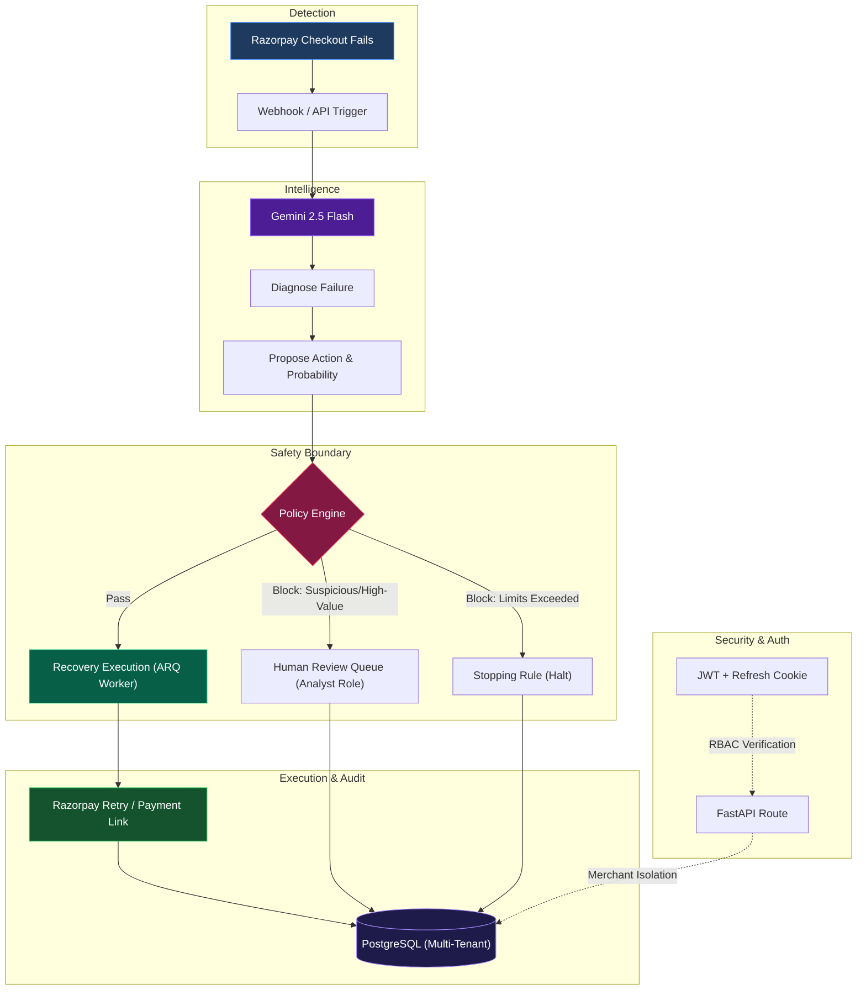

# RecoveryOS Architecture

Razorpay Buildathon · Track 03: AI Revenue Recovery

## Core Design Principle
**The AI Proposes. The Policy Engine Disposes. The Audit Log Remembers.**

RecoveryOS is designed around a strictly bounded AI agent. The AI is used for *intelligence* (diagnosing complex failures, extracting context), but it is never allowed to execute actions autonomously without passing through a deterministic, rule-based safety engine.

## End-to-End Pipeline

## Truth Model & State Management

RecoveryOS manages state across three distinct layers:

| Layer | Responsibility | Components |
|-------|----------------|------------|
| **Observed State** | What actually happened | Webhook events, failure reasons, amounts |
| **Decision State** | What the AI and Policy Engine decided to do | `RecoveryDecision`, `PolicyDecision`, Pending Reviews |
| **Audit/Execution State** | What was actually executed | `AuditRecord`, `ExecutionRecord` |

## Security, Tenancy & Graceful Degradation

- **Multi-Tenant by Design:** Every payment, execution, audit entry, and review belongs to exactly one `merchant_id`. Isolation is enforced by bounding repositories to a merchant at construction (e.g., `PostgresAuditRepository(session, merchant_id)`).
- **Authentication & RBAC:** Users authenticate via Argon2id hashed passwords to receive short-lived JWTs and rotating `httpOnly` refresh tokens. Routes are secured with strictly enforced roles (`Viewer`, `Analyst`, `Admin`).
- **Asynchronous Execution:** Heavy AI operations and Razorpay network calls run off the request path using **ARQ Redis Background Workers**. This prevents event loop blocking and ensures enterprise-grade resilience.
- **Distributed Rate Limiting:** Redis-backed sliding windows provide per-IP and per-user abuse protection. It is designed to fail open if Redis goes down, prioritizing availability.
- **Adversarial Resiliency:** A dedicated testing suite attacks the API with prompt injections, negative amounts, and fake fraud events. The LLM prompt itself uses strict structural boundaries.
- **Graceful Fallback:** If the Gemini API hits a rate limit (429) or fails, circuit breakers (Tenacity) handle backoffs, and the application gracefully falls back to a deterministic YAML taxonomy.

## Package Structure

| Path | Purpose |
|------|---------|
| `apps/web/` | Next.js 15 frontend. Real-time dashboard and Razorpay Checkout integration. |
| `apps/api/` | FastAPI backend. Orchestrates the recovery pipeline and serves data to the UI. |
| `domain/` | Core business logic, pure Python models. Contains the Policy Engine and Taxonomy. |
| `integrations/` | Adapters for external services (Razorpay, Google GenAI). |
| `docs/` | Architecture, Methodology, and Compliance documentation. |
| `tests/` | Comprehensive test suite containing Unit, Integration, Adversarial, and E2E tests. |

## Closed Set of Action Verbs

The AI is strictly constrained (via Structured Outputs) to propose actions from a closed set defined in `domain/policy/taxonomy.yaml`:

1. `retry_payment`: Silently retry a transient error.
2. `send_payment_link`: Generate a new checkout link for a dead instrument.
3. `send_reminder`: Nudge the customer to complete payment.
4. `escalate_to_merchant`: Route to the merchant for manual intervention.
5. `stop_recovery`: Halt all recovery attempts (e.g., confirmed fraud).

The AI cannot invent new verbs or bypass the `RecoveryActionType` enum.
